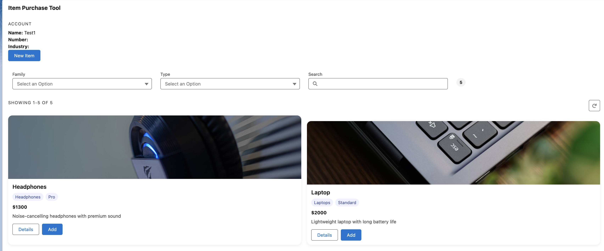
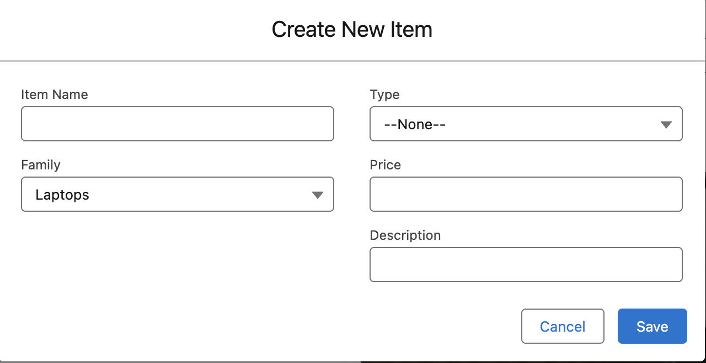
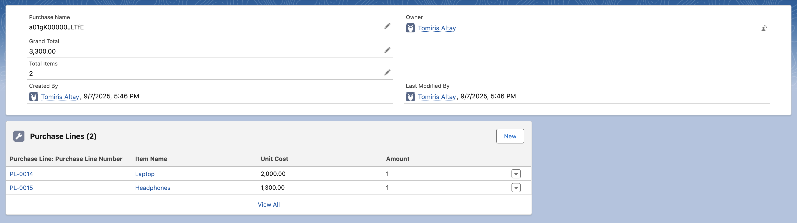

# Item Purchase Tool

A Salesforce LWC app to manage and purchase items with filters, Unsplash image auto-fill, and automatic totals.

---

## Installation

1. Install the unmanaged package into your org:  
   [Click here to install](https://login.salesforce.com/packaging/installPackage.apexp?p0=04tgK0000005VJJ)

2. Assign yourself **System Administrator** or a profile with access to:
   - Objects: `Item__c`, `Purchase__c`, `PurchaseLine__c`
   - Fields: `Name`, `Family__c`, `Type__c`, `Price__c`, `Description__c`, `Image__c`, totals.

---
## Testing

Run Apex tests:  
- `ItemControllerTest`  
- `PurchaseControllerTest`  
- `PurchaseLineTriggerHandlerTest`  
- `UnsplashServiceTest`  
- `UserControllerTest`

---

## Screenshots

